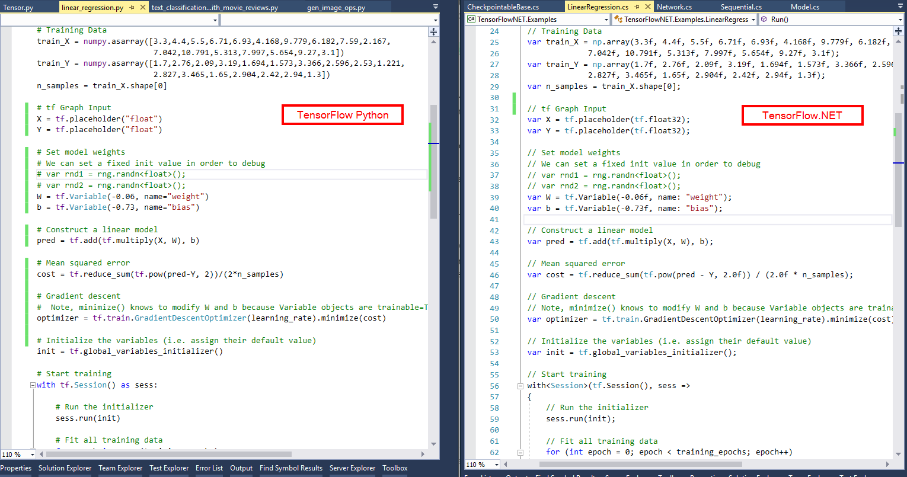

# TensorFlow.NET
TensorFlow.NET provides .NET Standard binding for [TensorFlow](https://www.tensorflow.org/). It's the full complete binding in CSharp language for TensorFlow API. It allows .NET developers to develop, train and deploy Machine Learning models in .NET standard which is running on cross-platform.

[](https://gitter.im/sci-sharp/community)
[](https://ci.appveyor.com/project/Haiping-Chen/tensorflow-net)
[](https://codecov.io/gh/SciSharp/NumSharp)
[](https://www.nuget.org/packages/TensorFlow.NET)
[](https://tensorflownet.readthedocs.io/en/latest/?badge=latest)

TensorFlow.NET is a member project of [SciSharp STACK](https://github.com/SciSharp).


### Why should we use TensorFlow.NET ?

`SciSharp STASK`'s mission is to create a zero learning curve on the .NET based technology stack Machine Learning tool library. Let's take a look at a comparison picture and you can see why TensorFlow.NET is the tool that is the most comfortable for you.



SciSharp's philosophy allows a large number of machine learning code written in python to be quickly migrated to .NET, allowing a large number of .NET Developers to use more updated models.

### How to use

Install TensorFlow.NET through NuGet.
```sh
PM> Install-Package TensorFlow.NET
```

If you are using Linux or Mac OS, please download the pre-compiled dll [here](tensorflowlib) and place it in the working folder. This is only need for Linux and Mac OS, and already packed into NuGet for Windows.

Import tensorflow.net.

```cs
using Tensorflow;
```

Add two constants.
```cs
// Create a Constant op
var a = tf.constant(4.0f);
var b = tf.constant(5.0f);
var c = tf.add(a, b);

using (var sess = tf.Session())
{
    var o = sess.run(c);
}
```

Feed placeholder.
```cs
// Create a placeholder op
var a = tf.placeholder(tf.float32);
var b = tf.placeholder(tf.float32);
var c = tf.add(a, b);

using(var sess = tf.Session())
{
    var feed_dict = new Dictionary<Tensor, object>();
    feed_dict.Add(a, 3.0f);
    feed_dict.Add(b, 2.0f);

    var o = sess.run(c, feed_dict);
}
```

Read the docs & book [The Definitive Guide to Tensorflow.NET](https://tensorflownet.readthedocs.io/en/latest/FrontCover.html).

### More examples:

* [Hello World](test/TensorFlowNET.Examples/HelloWorld.cs)
* [Basic Operations](test/TensorFlowNET.Examples/BasicOperations.cs)
* [Image Recognition](test/TensorFlowNET.Examples/ImageRecognition.cs)
* [Linear Regression](test/TensorFlowNET.Examples/LinearRegression.cs)
* [Text Classification](test/TensorFlowNET.Examples/TextClassificationWithMovieReviews.cs)
* [CNN Text Classification](test/TensorFlowNET.Examples/CnnTextClassification.cs)
* [Naive Bayes Classification](test/TensorFlowNET.Examples/NaiveBayesClassifier.cs)
* [Named Entity Recognition](test/TensorFlowNET.Examples/NamedEntityRecognition.cs)

Star me or raise issue on [Github](https://github.com/SciSharp/TensorFlow.NET) feel free.

Scan QR code to join Tencent TIM group:


