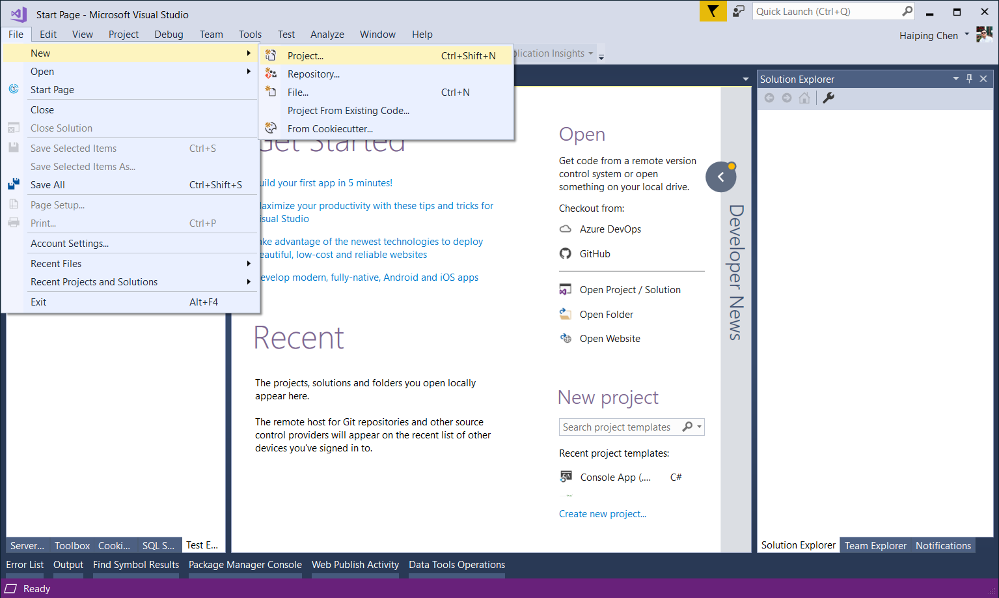
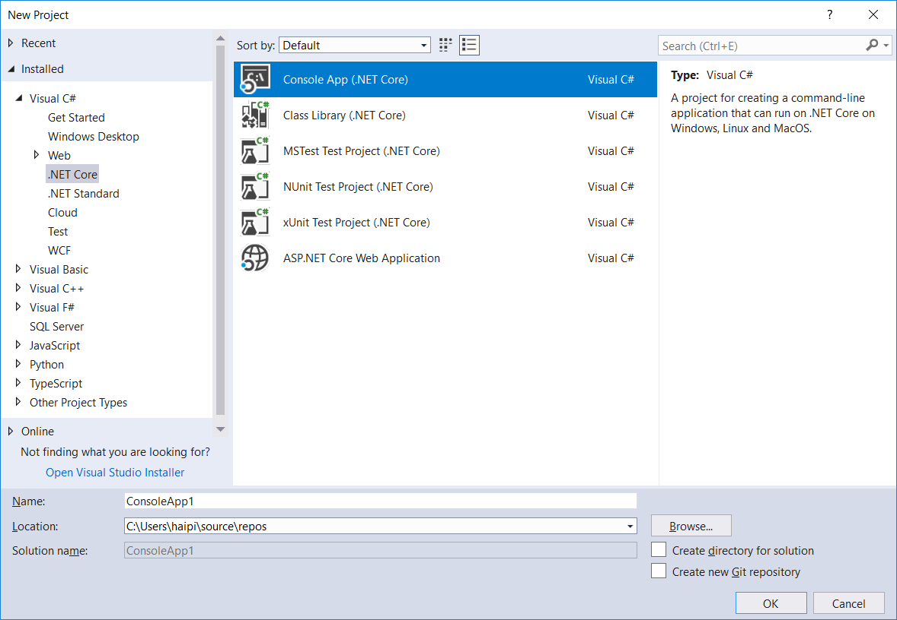

# 	Get started with TensorFlow.NET

I would describe TensorFlow as an open source machine learning framework developed by Google which can be used to build neural networks and perform a variety of machine learning tasks. it works on data flow graph where nodes are the mathematical operations and the edges are the data in the form of tensor, hence the name Tensor-Flow. 

按照我的理解，TensorFlow是Google公司开发的一个开源机器学习框架，可以用来搭建神经网络模型和其它传统机器学习模型，它采用了图计算模型，图的节点和边分别代表了操作和数据输入或输出，数据在图的单个方向传递，因此这个过程形象地取名叫做TensorFlow。

Let's run a classic HelloWorld program first and see if TensorFlow is running on .NET. I can't think of a simpler way to be a HelloWorld.

让我们先运行一个经典的HelloWorld程序，看看TensorFlow在.NET上面运行的效果，我想不出有比做个HelloWorld更简单的方式了。


### Install the TensorFlow.NET SDK

TensorFlow.NET uses the .NET Standard 2.0 standard, so your new project Target Framework can be .NET Framework or .NET Core.  All the examples in this book are using .NET Core 2.2 and Microsoft Visual Studio Community 2017. To start building TensorFlow program you just need to download and install the .NET SDK (Software Development Kit). You have to download the latest .NET Core SDK from offical website: https://dotnet.microsoft.com/download.

TensorFlow.NET采用.NET标准库2.0版本，因此你的新建工程可以是.NET Framework或者是基于.NET Core的。本文中的所有例子都是用的.NET Core 2.2的，IDE用的是Microsoft Visual Studio Community 2017。为了能编译和运行TensorFlow工程，你需要从这里下载最新的.NET Core SDK: https://dotnet.microsoft.com/download。

1. New a project

   

2. Choose Console App (.NET Core)

   


```cmd
PM> Install-Package TensorFlow.NET
```

### Start coding Hello World

After installing the TensorFlow.NET package, you can use the `using Tensorflow` to introduce the TensorFlow library.

安装完TensorFlow.NET包后，你就可以使用`using Tensorflow`来引入TensorFlow库了。

```csharp
using System;
using Tensorflow;

namespace TensorFlowNET.Examples
{
    /// <summary>
    /// Simple hello world using TensorFlow
    /// </summary>
    public class HelloWorld : IExample
    {
        public void Run()
        {
            /* Create a Constant op
               The op is added as a node to the default graph.
            
               The value returned by the constructor represents the output
               of the Constant op. */
            var hello = tf.constant("Hello, TensorFlow!");

            // Start tf session
            using (var sess = tf.Session())
            {
                // Run the op
                var result = sess.run(hello);
                Console.WriteLine(result);
            }
        }
    }
}
```
After CTRL + F5 run, you will get the output.
```cmd
2019-01-05 10:53:42.145931: I tensorflow/core/platform/cpu_feature_guard.cc:141] Your CPU supports instructions that this TensorFlow binary was not compiled to use: AVX2
Hello, TensorFlow!
Press any key to continue . . .
```

This sample code can be found at [here](https://github.com/SciSharp/TensorFlow.NET/blob/master/test/TensorFlowNET.Examples/HelloWorld.cs).

此示例代码可以在[这里](https://github.com/SciSharp/TensorFlow.NET/blob/master/test/TensorFlowNET.Examples/HelloWorld.cs)找到。

