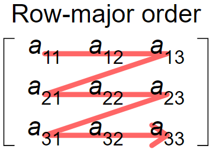

# Chapter 1. Tensor 第一章: Tensor

### Represents one of the outputs of an Operation

### 表示一个操作的输出


##### What is Tensor?

##### Tensor 是什么?

Tensor holds a multi-dimensional array of elements of a single data type which is very similar with numpy's ndarray. 

Tensor是一个具有单一数据类型的多维数组容器，非常类似于numpy里的ndarray。如果你对numpy非常熟悉的话，那么对Tensor的理解会相当容易。


##### How to create a Tensor?

##### 如何创建一个Tensor?


TF uses column major order.

TF 采用的是按列存储模式，如果我们用NumSharp产生一个2 X 3的矩阵，如果按顺序从0到5访问数据的话，是不会得到1-6的数字的，而是得到1，4， 2， 5， 3， 6这个顺序的一组数字。

```cs
// generate a matrix:[[1, 2, 3], [4, 5, 6]]
var nd = np.array(1f, 2f, 3f, 4f, 5f, 6f).reshape(2, 3);
// the index will be   0  2  4    1  3  5, it's column-major order.
```



